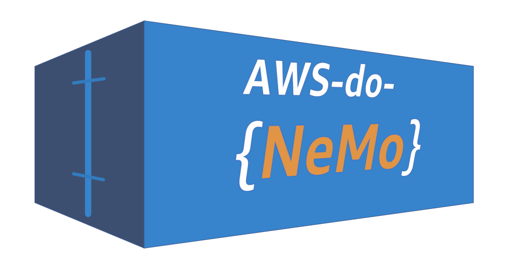

# AWS do Nemo (aws-do-nemo) - Run model pretraining and finetuning jobs with [NVIDIA NeMo](https://github.com/NVIDIA/NeMo) and the [do-framework](https://bit.ly/do-framework)

[NVIDIA NeMo](https://github.com/NVIDIA/NeMo) is a GenAI framework designed to help you efficiently create, customize, and deploy various models by leveraging existing code and pre-trained model checkpoints.
The [do-framework](https://bit.ly/do-framework) is a DevOps framework focused on simplicity, intuitiveness, and productivity to help you get more done with less effort.
Combining the two frameworks, this project builds a container that has all necessary code and automation to run model pretraining and finetuning jobs on [Amazon EKS](https://aws.amazon.com/eks) or [SageMaker HyperPod EKS](https://aws.amazon.com/sagemaker-ai/hyperpod/).

This project assumes that you already have an Amazon EKS or a HyperPod EKS cluster. If you need to create one, please refer to the [prerequisites section](https://github.com/aws-samples/awsome-distributed-training/tree/main/3.test_cases/megatron/nemo/kubernetes#prerequisites) of the NeMo examples. When using this project, you build or optionally use a pre-built container image and start a shell which acts as your environment for running NeMo pretraining and finetuning [examples](https://github.com/aws-samples/awsome-distributed-training/tree/main/3.test_cases/megatron/nemo/kubernetes). All necessary tools and utilities are available in the `aws-do-nemo` container shell, so you may skip the [Setting up Development Environment](https://github.com/aws-samples/awsome-distributed-training/tree/main/3.test_cases/megatron/nemo/kubernetes#2-setting-up-development-environment) section of the instructions.


The project contains the following scripts:
* `config.sh` - open the configuration file .env in an editor so the project can be customized
* `build.sh` - build the container image
* `test.sh` - run container unit tests
* `push.sh` - push the container image to a registry
* `pull.sh` - pull the container image from a registry
* `run.sh [cmd]` - run the container, passing an argument overrides the default command
* `status.sh` - show container status - running, exited, etc.
* `logs.sh` - tail container logs
* `exec.sh [cmd]` - open a shell or execute a specified command in the running container

## Getting Started

To get started with this project, follow these steps:

1. **Build the container image:**
   ```bash
   ./build.sh
   ```

2. **Run the container:**
   ```bash
   ./run.sh
   ```

3. **Log into the running container:**
   ```bash
   ./exec.sh
   ```

4. **Navigate to the kubernetes directory to get started:**

The following are paths to the /kubernetes folder where the nemo examples are located:

Inside the `aws-do-nemo` container:

   ```bash
   cd /nemo/kubernetes
   ```
Inside the `aws-do-nemo` container, mounting the `aws-do-nemo` project folder from the host:

   ```bash
   cd /aws-do-nemo/Container-Root/nemo/kubernetes
   ```

The following shortcut is provided for your convenience:

   ```bash
   . k
   ```

Once you're in the kubernetes directory, you can explore the various scripts and configurations available for training and fine-tuning models. Follow the [README](https://github.com/aws-samples/awsome-distributed-training/blob/main/3.test_cases/megatron/nemo/kubernetes/README.md) for step-by-step instructions on preparing the cluster, curating the data, and running the examples.

## Security

See [CONTRIBUTING](CONTRIBUTING.md#security-issue-notifications) for more information.

## License

This project is licensed under the MIT-0 License. See the [LICENSE](LICENSE) file.

## Disclaimer

This sample code should not be used in production accounts, on production workloads, or on production or other critical data. You are responsible for testing, securing, and optimizing the sample code as appropriate for production-grade use based on your specific quality control practice and standards.

## References

* [Docker](https://docker.com)
* [Kubernetes](https://kubernetes.io)
* [Amazon Web Services (AWS)](https://aws.amazon.com/)
* [Amazon EC2 instance types](https://aws.amazon.com/ec2/instance-types/)
* [Amazon Elastic Kubernetes Service (EKS)](https://aws.amazon.com/eks)
* [do-framework](https://bit.ly/do-framework)
* [Depend on Docker](https://github.com/iankoulski/depend-on-docker)
* [NVIDIA NeMo](https://github.com/NVIDIA/NeMo)
* [SkyPilot](https://github.com/skypilot-org/skypilot)
* [AWSome Distributed Training](https://github.com/aws-samples/awsome-distributed-training/tree/main/3.test_cases/megatron/nemo/kubernetes)

## Credits
* Abdullahi Olaoye
* Akshit Arora
* Alex Iankoulski
* Ankur Srivastava
* Daisy Leung
* Daniel Zilberman
* Mark Vinciguera
* Court Schuett
